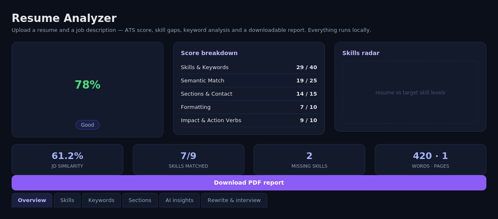
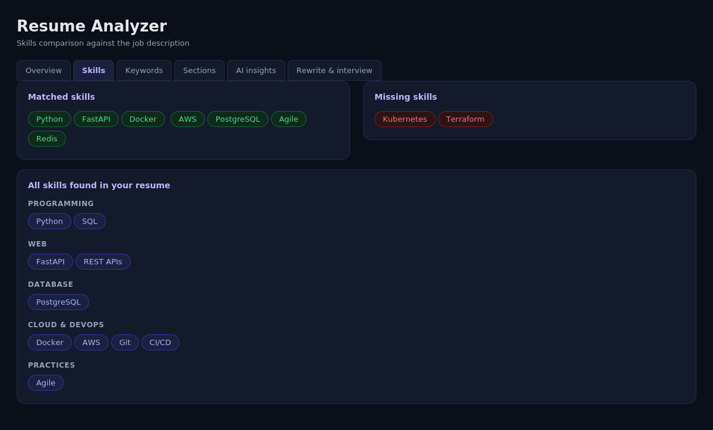
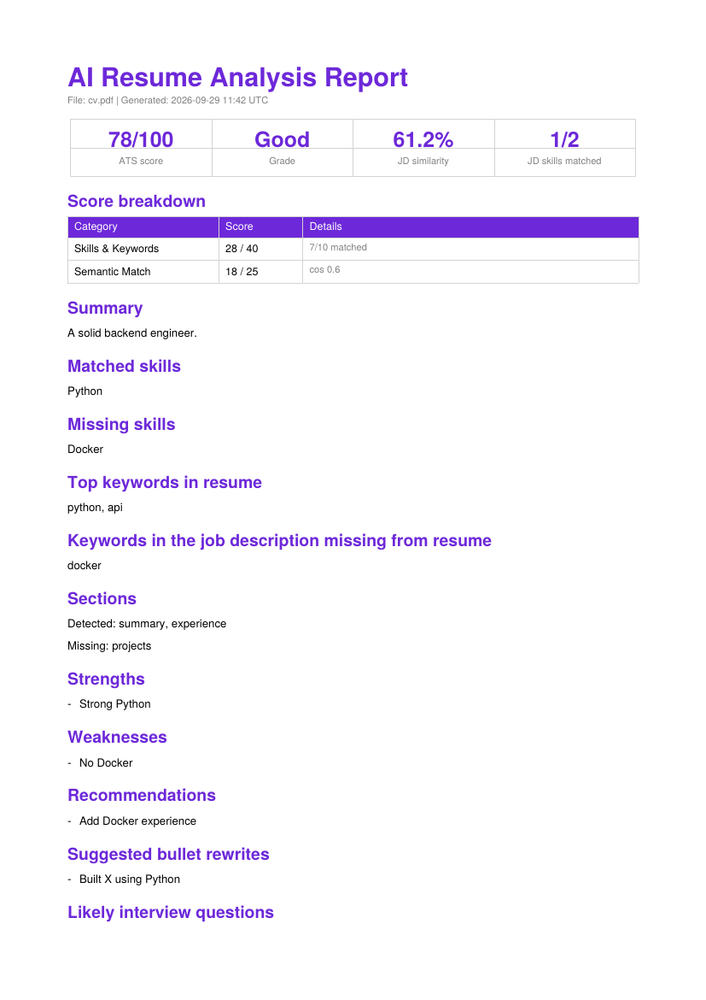

# AI Resume Analyzer

A complete, self-hostable AI resume analyzer built entirely with **free/open-source tools** —
no paid APIs required. Upload a resume (PDF) and a job description, and get an ATS score,
skill-gap analysis, keyword coverage, a resume summary, and a downloadable PDF report.





*Screenshots above: `01_overview.png`/`02_skills.png` are UI mockups matching the real
Streamlit layout (rendered outside a browser for this README); `03_pdf_report.png` is a real
page generated by the app's `/report` endpoint.*

## Tech stack

| Layer | Tool |
|---|---|
| API | **FastAPI** (Python 3.11) |
| UI | **Streamlit** (dark theme) |
| PDF parsing | **pdfplumber** |
| PDF report | **ReportLab** |
| Skills/keywords | **spaCy** (`en_core_web_sm`) + a curated skill taxonomy |
| Semantic similarity | **Sentence-Transformers** (`all-MiniLM-L6-v2`) |
| AI writing (summary, bullets, interview Qs) | **Ollama** running **Llama 3.1** (local, free) |
| Storage (optional) | **PostgreSQL** via SQLAlchemy |
| Containerization | **Docker** / **docker-compose** |
| CI | **GitHub Actions** (tests + Docker build on every push) |

Everything runs on your own machine. There is no dependency on OpenAI or any paid service —
the LLM step is optional and, if Ollama isn't running, the app **degrades gracefully** to
rule-based summaries/questions instead of failing.

## Features

- 📄 Upload a resume PDF (drag & drop)
- 📋 Paste or upload a job description (PDF/TXT)
- 🎯 **ATS score (0–100)** with a transparent, weighted breakdown (skills, semantic match,
  sections/contact, formatting, impact/action verbs) — shown as a donut + radar chart
- 🧩 **Missing skills detection** against a 90+ term technical/soft-skill taxonomy across
  8 categories (Programming, Web, Database, Cloud & DevOps, Data & ML, Practices, Soft Skills)
- 🧠 **AI resume summary**, strengths/weaknesses (Llama 3.1 via Ollama, with a rule-based fallback)
- 🔗 **Job description similarity score** (sentence-embedding cosine similarity, with a
  lexical-overlap fallback if the embedding model can't load)
- 🔑 **Keyword extraction** (noun-phrase based) for both resume and JD, with a "missing keywords" list
- 🧱 **Section detection** (Summary, Experience, Education, Skills, Projects, Certifications…)
- ✍️ **Suggested bullet rewrites** and **likely interview questions**, tailored to the JD and gaps
- ⬇️ **Downloadable PDF report** of the full analysis
- 🌙 **Dark UI** built in Streamlit
- 🗄️ Optional history of past analyses in Postgres

## Architecture

```
┌─────────────┐      multipart/form-data       ┌──────────────┐
│  Streamlit  │ ──────────────────────────────▶ │   FastAPI     │
│  (frontend) │ ◀────────────────────────────── │   (backend)   │
└─────────────┘         JSON / PDF               └──────┬───────┘
                                                         │
                     ┌───────────────┬──────────────────┼───────────────┐
                     ▼               ▼                  ▼               ▼
               pdfplumber        spaCy +          Sentence-        Ollama
              (text extract)   skill taxonomy    Transformers     (Llama 3.1)
                                                  (similarity)   summary/bullets/Qs
                                                                        │
                                                                        ▼
                                                                 PostgreSQL (optional)
```

## Folder structure

```
ai-resume-analyzer/
├── backend/
│   ├── app/
│   │   ├── main.py              # FastAPI routes: /health, /analyze, /report, /history
│   │   ├── config.py            # Settings (env vars)
│   │   ├── schemas.py           # Pydantic request/response models
│   │   ├── db.py                # Optional Postgres persistence
│   │   └── services/
│   │       ├── pdf_parser.py    # pdfplumber text extraction
│   │       ├── sections.py      # Resume section detection
│   │       ├── skills.py        # Skill taxonomy (90+ skills, 8 categories)
│   │       ├── nlp.py           # spaCy skill/keyword/contact extraction
│   │       ├── embeddings.py    # Sentence-Transformers similarity (+ lexical fallback)
│   │       ├── scoring.py       # Transparent ATS scoring engine
│   │       ├── llm.py           # Ollama/Llama 3.1 integration (+ fallback)
│   │       └── report.py        # ReportLab PDF report builder
│   ├── tests/                   # pytest unit + API tests
│   ├── requirements.txt
│   └── Dockerfile
├── frontend/
│   ├── app.py                   # Streamlit dark UI
│   ├── .streamlit/config.toml   # Dark theme config
│   ├── requirements.txt
│   └── Dockerfile
├── sample_data/
│   ├── sample_resume.pdf
│   └── job_description.txt
├── scripts/
│   ├── run_local.sh             # Run without Docker
│   └── pull_model.sh            # Pull the Ollama model
├── docs/
│   ├── screenshots/
│   ├── resume_bullet_points.md
│   └── interview_questions.md
├── .github/workflows/ci.yml     # GitHub Actions: tests + Docker build
├── docker-compose.yml
├── .env.example
└── README.md
```

## Quick start (Docker — recommended)

```bash
git clone <your-repo-url> ai-resume-analyzer
cd ai-resume-analyzer
cp .env.example .env          # defaults work out of the box

docker compose up -d --build
./scripts/pull_model.sh llama3.1     # first time only, downloads ~4.7GB
```

- Frontend (Streamlit): http://localhost:8501
- Backend (FastAPI docs): http://localhost:8000/docs

The backend, Postgres and Ollama all run as containers. The first `/analyze` call also
downloads the `all-MiniLM-L6-v2` embedding model (~90MB) and the spaCy model, cached afterward
in the backend image layer / volume.

### Running without Postgres or a local LLM

The app works with **zero external services**:
- If `DATABASE_URL` is empty, history is simply disabled (analysis still works).
- If Ollama isn't reachable, `/analyze` falls back to rule-based summaries, bullet templates,
  and generic interview questions — the request never fails because of the LLM.

Copy `docker-compose.override.example.yml` to `docker-compose.override.yml` for a
Postgres/Ollama-free compose file (e.g. if you already run Ollama natively on the host).

## Running locally without Docker

```bash
./scripts/run_local.sh
```

This creates a virtualenv, installs both requirement files, downloads the spaCy model, and
starts FastAPI (port 8000) + Streamlit (port 8501). Install and start
[Ollama](https://ollama.com) separately and run `ollama pull llama3.1` for AI insights.

## API reference

| Method | Path | Description |
|---|---|---|
| GET | `/health` | Service + Ollama + DB status |
| POST | `/analyze` | `multipart/form-data`: `resume` (PDF, required), `jd_text` or `jd_file`, `use_llm` (bool) → `AnalysisResult` JSON |
| POST | `/report` | Body: an `AnalysisResult` JSON (as returned by `/analyze`) → PDF file |
| GET | `/history?limit=20` | Past analyses (requires `DATABASE_URL`) |

Full interactive docs at `/docs` (Swagger UI) once the backend is running.

## Testing

```bash
cd backend
pip install -r requirements.txt && python -m spacy download en_core_web_sm
pytest -v
```

Tests cover section detection, skill extraction (including that ambiguous words like "go"
aren't falsely matched), ATS score bounds/weights, and full `/analyze` + `/report` API
round-trips using a generated sample PDF (embeddings/LLM are mocked so tests run offline and fast).
CI (`.github/workflows/ci.yml`) runs these on every push and also builds both Docker images.

## How the ATS score works

The 100-point score is a transparent sum of five weighted categories (see `scoring.py`):

| Category | Weight | What it measures |
|---|---|---|
| Skills & Keywords | 40 | % of JD-required skills found + keyword coverage |
| Semantic Match | 25 | Embedding cosine similarity between resume and JD |
| Sections & Contact | 15 | Standard sections present + email/phone/LinkedIn found |
| Formatting | 10 | Word count in a healthy range, bullet usage, dated entries |
| Impact & Action Verbs | 10 | Quantified results (%, $, counts) and strong action verbs |

No category is a black box — the API returns the raw sub-scores and a one-line reason for each.

## Notes & limitations

- Scanned/image-only PDFs aren't supported (no OCR pipeline included) — export resumes as
  text-based PDFs.
- The skill taxonomy and section headings are tuned for English-language, US/EU-style resumes.
- The LLM is prompted not to invent employers, numbers or technologies not present in the
  resume, but always review AI-written bullets/summaries before using them.
- This tool estimates ATS-friendliness heuristically; it does not reproduce any specific
  commercial ATS vendor's proprietary algorithm.

## License

MIT — use freely for personal or commercial projects.
